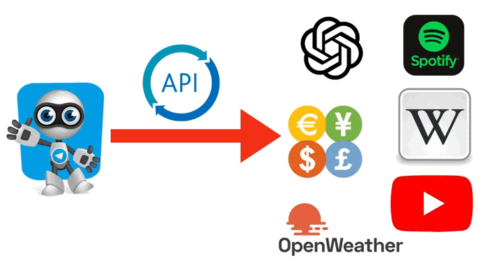

# Telegram bot

A simple telegram bot for searching services (ChatGPT, Wikipedia, Spotify, Youtube, Open weather) using the API. 


## Installation libraries:
```python
pip install -r requirements.txt
```
or
```python
pip install telebot
pip install g4f
pip install wikipediaapi
pip install spotipy

```
    
## API Reference

| Parameter | Type     | Description                |
| :-------- | :------- | :------------------------- |
| `token_telegram` | `string` | **Required**. Your telegram token | `api_key_weather` | `string` | **Required**. Your API key 
| `api_key_yotube` | `string` | **Required**. Your API key youtube
| `client_id_spotify` | `string` | **Required**. Your client id 
| `client_secret_spotify` | `string` | **Required**. Your client secret 
| `Wiki_project` | `string` | **Required**. Name of project

## Screenshots / Video



## Usage/Examples

```python
import g4f

def my_gpt(prompt):
        response = g4f.ChatCompletion.create(
            model="gpt-3.5-turbo",
            messages=[{"role": "user", "content": prompt}],  
            stream=True,
        )
        for element in response:
            answer = answer + element
        return answer
```
```python
import wikipediaapi

def my_wiki(my_command, prompt):
    if my_command in ('/w_en', '/w', '/wiki'):
        wiki_wiki = wiki_wiki = wikipediaapi.Wikipedia(f'{wiki_key_project}', 'en')
    else:
        wiki_wiki = wiki_wiki = wikipediaapi.Wikipedia(f'{wiki_key_project}','ru')  # RU Wiki
    page_py = wiki_wiki.page(prompt)
    if page_py.exists():
        answer = page_py.title + '\n' + page_py.text[:1000] + '\n' + page_py.fullurl
        return answer
    else:
        return f' Nothing found. Try the request again'
```
```python
import spotipy
from spotipy.oauth2 import SpotifyClientCredentials

def my_spotify(prompt):
    sp = spotipy.Spotify(auth_manager=SpotifyClientCredentials(client_id=client_id,
                                                                   client_secret=client_secret))

    results = sp.search(q=prompt, type='artist', limit=1)
    if results:
        answer = results['artists']['items'][0]['external_urls']['spotify']  # URL of spotify
        results = sp.search(q=prompt, limit=3)  
        return answer
    else:
        return f'Artist {prompt} not found'
```

```python
from googleapiclient.discovery import build

def my_youtube(prompt):
    youtube = build('youtube', 'v3', developerKey=api_key_yotube)
    search_query = prompt
    request = youtube.search().list(
        q=search_query,
        type='video',
        part='id,snippet',
        maxResults=5)
    response = request.execute()
    for item in response['items']:
        video_id = item['id']['videoId']
        video_url = f'https://www.youtube.com/watch?v={video_id}'
        video.append(video_url)
    return video
```


